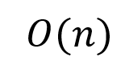

# Relatório Trabalho Parcial AED2

## Integrantes

* Bruno Maciel
* Girlana Souza
* Marcello Cipriano
* Natanael Oliveira

## Sumário

*******

 1. [Introdução](#introducao)
 2. [Projeto da implementação](#projimpl)

    2.1. [*typeTableHash*](#projimpl2)

    2.1.1. [Defificao](#211)

    2.1.2. [Fator de carga](#212)

    2.1.3. [Quando executar *rehashing*](#213)

    2.1.4. [Rehashing](#214)

    2.2. [TypeStaticDictionary](#22)

    2.3. [typeStopWords](#23)

    2.4. [typeDynamicDictionary](#24)

    2.5. [typeIndex](#25)

    2.6. [tipoPalavra](#26)

    2.7. [typeDocument](#27)

    2.8. [typeLinkedList](#28)

    2.9. [Fluxo da Aplicação](#29)

 3. [Discussões e Resultados](#conclusion)
 4. [Conclusão](#projimpl2)

*******

## 1. Introdução

Um Índice Remissivo é uma lista de termos ou expressões presentes em uma obra escrita juntamente com suas respectivas páginas de referência. É uma ferramenta útil para ajudar o leitor a encontrar informações específicas dentro de um documento grande. O índice remissivo será mais eficiente quando conseguir direcionar o leitor para as ocorrências mais significativas de uma palavra no texto.

A presença de *stop words* é uma questão importante a ser considerada durante a implementação do trabalho. *Stop words* são termos comuns, como preposições, artigos, advérbios, números, pronomes e pontuação, que geralmente não são considerados relevantes para um documento.

O conceito de TF-IDF é uma medida estatística que avalia a importância de uma palavra em um documento em relação a uma coleção de documentos. A sigla significa "Frequência do Termo - Inversa da Frequência no Documento" e combina a frequência de um termo (TF) no documento com sua rareza (IDF) na coleção de documentos. O objetivo é identificar as palavras mais informativas e exclusivas do documento, permitindo assim uma melhor compreensão e análise do conteúdo.

No contexto de um único documento, o TF-IDF é calculado como o produto da frequência do termo (TF) e a frequência inversa do documento (IDF). A frequência de um termo em um documento (TF) é o número de vezes que o termo aparece no documento, enquanto a frequência inversa do documento (IDF) é calculada como o logaritmo do número total de documentos dividido pelo número de documentos que contêm o termo. No caso, uma *stop word* não possui nível de relevância, dessa forma, sua frequência é desconsiderada na implementação desse trabalho.

Este trabalho tem como objetivo criar um programa que gerará um índice remissivo de um livro em formato de texto. Isso será realizado utilizando conceitos de Tipos Abstratos de Dados (TAD) e técnicas de armazenamento como dicionários estáticos e dinâmicos. O resultado final será um conjunto de cinco páginas de cada palavra do livro, ordenado pelo número de relevância. Para garantir a eficiência e performance, é importante escolher uma estrutura de dados adequada e aplicar técnicas eficientes de armazenamento e busca de informações.

  

## 2. Projeto da implementação (Métodos)

Uma das primeiras e mais importantes tarefas relacionadas com a ideia de construção de um índice remissivo de uma obra literária utilizando uma ferramenta computacional é, sobretudo, a escolha ou identificação dos tipos de estruturas de dados que permitiriam a manipulação mais eficiente dos dados relacionados com tal aplicação.

Sabe-se que uma obra literária contém um texto fixo de palavras escritas em determinado idioma, portanto não sujeitos a frequentes alterações e acréscimos. Até mesmo em outros tipos bibliográficos, como por exemplo, nos livros didáticos, cujas alterações ou atualizações acontecem com uma maior frequência, estas não costumam produzir acréscimos significativos de conteúdo em comparação à obra como um todo.

Nessas condições, é possível perceber que a utilização do conceito de dicionário para um projeto de índice remissivo é muito adequada, na medida em que esse gênero de estrutura de dados, mesmo as que possuem a característica de um maior dinamismo no tocante à atualização das informações, tem por escopo trabalhar a manipulação de dados mais fixos, ou melhor dizendo, mais definitivos, como no caso do presente projeto; permitindo, assim, que a estrutura concentre suas aptidões ou dê maior ênfase à eficiência dos processos de acesso, busca e manipulação interna das informações, conforme a necessidade da aplicação que a utiliza.

Sabe-se que a estrutura do dicionário traz em si apenas um conceito genérico, do qual se extrai certos padrões e características, acima rapidamente abordados, que direcionam a sua aptidão para uma dada aplicação, na esteira do escopo de um TAD, por exemplo. Porém, na sua base de construção propriamente dita, faz-se necessário escolher um tipo específico de estrutura de dados que trabalhe bem com a ideia de dicionário nos moldes mais adequados às funções previstas para o modelo e adapatado ao objeto específico de sua utilização.

Uma das mais clássicas abordagens para construção de dicionário é a que utiliza as tabelas de espalhamento ou dispersão, as conhecidas tabelas *hash*, que tem por principal característica otimizar os processos de seleção e busca de informações, em níveis superiores até aos dos mais eficientes algoritmos para essa atividade específica, como os de busca binária, por exemplo, os quais ainda exigem o contexto da ordenação dos dados. [Maurer et al., 1975]

Além disso, importante frisar que a tabela *hash* tem também alta indicação para processos em que o universo dos dados a serem manipulados seja relativamente conhecido pelo próprio usuário da aplicação, especialmente quanto a uma estimativa de quantidade de informações sob manuseio, o que poderia facilitar a customização da estrutura de dados, sendo esta uma das principais características dessas tabelas de dispersão. [Botelho, 2004]

Observa-se, portanto, que a ideia de utilização das tabelas de espalhamento claramente se enquadra no modelo de dicionário para a aplicação ora em comento, que se propõe a processar um conjunto limitado e conhecido de dados, facilmente estimáveis, como uma quantidade de palavras em um livro.

Nessa esteira, o projeto se iniciou com a ideia de construir inicialmente dois tipos de dicionários: um, de característica mais estática, isto é, de conteúdo fixo e de uso genérico, para a guarda de um índice das mencionadas *stop words*; e um outro, dinâmico, com maioir facilidade para a inserção de diferentes conteúdos e eventuais alterações, que seria utilizado na guarda e organização dos dados que seriam manipulados pelo índice remissivo propriamente dito.

Dessa forma, para organizar o projeto, foram criados Tipos Abstratos de Dados, que possuem estruturas específicas e funções específicas para manipular os dados relacionados ao escopo do projeto. Abaixo, está uma explicação detalhada de cada tipo desenvolvido.

  

### 2.1 *typeTableHash*

#### 2.1.1 Definição

Este é o TAD de base, onde se implementa a estrutura de dados que será usada para administrar o uso das espécies de dicionários que serão úteis na aplicação computacional de que trata o presente trabalho. Neste tipo, tem-se a modelagem de uma tabela *hash* com parâmetros flexíveis a permitir a criação de uma tabela de dispersão com diferentes características, desde modelos mais estáticos, de tamanho fixos, a alternativas de crescimento dinâmico (*rehashing*) e com variação do fator de carga, a possibilitar eficiência de busca sempre superior a de um algoritmo
de busca binária, sem a necessidade de ordenação completa.

#### 2.1.2 Fator de carga

Fator de carga é a expectativa de desempenho no pior caso de busca da tabela *hash*. O tamanho das listas encadeadas depende da função de espalhamento, de acordo com a variação, o tamanho pode ser menor ou maior que o fator de carga.

#### 2.1.3 Quando executar *rehashing*

Na implementação do trabalho, foram considerados duas métricas: métrica de dispersão da tabela e métrica de maior lista encadeada no conjunto

* Métrica de dispersão na tabela:
    Essa métrica mede o nível de agrupameto na tabela. Para realizar o seu cálculo foi utilizado a seguinte fórmula:

    

    

    
    Na fómula acima, Xi indica o número de colisões ou o tamanho da lista formada a partir de uma entrada da tabela. Dessa forma, o nível de agrupamento da *hash* é dado pelo somatório do quadrado do tamanho de cada entrada, dividido pelo número de elementos da tabela ou de chaves mapeadas, menos o fator de carga aplicado. Caso o índice supere 1.0 (um), significa que o espalhamento não está eficiente e indica a necessidade de um eventual *rehashing* .
 
* Maior lista encadeada:
    Esta avaliação monitora o tamanho da maior lista encadeada. Quando esse tamanho utrapassa o fator de carga, isso significa que será necessário realizar o *rehashing*.

#### 2.1.4 *Rehashing*

A funcao de *rehashing* aumenta o tamanho da tabela usando a seguinte equancao:

Em que *l* é o novo tamanho, *i* é o total de chaves atual e *n* o tamanho atual da tabela.

### 2.2 *typeStaticDictionary*

Tipo Abstrato básico, de camada intermediária, que modela genericamente a implementação de uma estrutura de Dicionário com característica mais estática, contendo somente funções que permitem o carregamento (inserção dos elementos) e a consulta, portanto sem previsão para remoções. No contexto do presente trabalho, é o plano de fundo do *typeStopWords* e suas respectivas funções de manipulação de dados.

### 2.3 *typeStopWords*

Tipo responsável pela criação do coadjuvante dicionário de *stop words*, com a implementação de uma função de pesquisa dessa espécie de dicionário de caráter mais estático, a fim de facilitar a identificação das palavras que não precisam ser consideradas na confecção do índice remissivo.

### 2.4 *typeDynamicDictionary*

Também é um tipo básico de camada intermediária que implementa genericamente uma estrutura de Dicionário, porém com atributos e funções de um grau maior de flexibilidade quanto à manipulação dos dados, pois admite operações, não só de inserção e consulta, mas também de remoção eventual. Será útil para caracterizar a modelagem do Índice Remissivo propriamente dito.

### 2.5 *typeIndex*

Contém o TAD de mais alto nível da aplicação, ao qual se vinculam todos os demais tipos abstratos intermediários, bem como um cojunto de funções auxiliares de manipulação de strings e outras utilidades, para tornar operável o sistema de montagem (processo de leitura e guarda de dados) e consulta do Índice Remissivo reclamado no projeto. Nele também estão previstos os processos de confecção dos arquivos contendo as avaliações de seu desempenho.

### 2.6 *tipoPalavra*

Tipo Abstrato de importância central contendo a previsão da estrutura de guarda dos dados principais (palavras e seus atributos) que serão manipulados pelos dicionários e usados na modelagem do índice remissivo, bem como no processamento das avaliações estatísticas e comparativas. Contém também as funções de organização e ordenação das palavras conforme a relevância de suas ocorrências nas páginas.

### 2.7 *typeDocument*

Documento, na esteira do presente trabalho, é cada página das obras literárias.
O TAD em referência tem caráter auxiliar do tipoPalavra, pois objetiva primordialmente apoiar a manipulação dos dados com uma administração estratificada por documento, organizando o processo de leitura e guarda das palavras a partir de uma pauta da página com indicadores de seu início e fim, além de um contador de palavras, útil para o cálculo do fator de relevância da palavra em cada documento.

### 2.8 *typeLinkedList*

Também é um tipo auxiliar, usado com fins organizativos para especializar as funções de montagem e manuseio dos dados guardados nas estruturas de listas que vão compor as entradas da tabela principal de guarda e busca dos dados contidos nos dicionários.

### 2.9.Fluxo da Aplicação

## 3. Discussões e Resultados

Após a implementação do Índice Remissivo, conforme o modelo acima descrito, foi utilizada uma base de dados de teste fornecida pelo professor Cesar Melo, contendo os textos completos, em formato digital, de três obras literárias:

* As Aventuras de Huckleberry Finn (1);
* O Guarani (2); e
* Paralelismo em visao natural e artificial (3)

A aplicação foi capaz de construir um índice remissivo para cada obra, com indicativo de todas as palavras contidas nos textos, não classificadas como *stop words*. Todas as palavras apresentadas pelo índice foram associadas às respectivas páginas em que ocorre, porém limitadas ao número máximo de 5 (cinco) páginas por palavra, selecionadas segundo a ordem de relevância do termo no contexto de cada página em comparação com as demais onde a palavra ocorre.

Um dos principais objetivos do trabalho era permitir que fosse feita uma avaliação da eficiência e performance das estruturas de dados usadas na construção dos dicionários e do índice remissivo propriamente dito, motivo pelo qual foram incorporados ao projeto da implementação, algumas estruturas e funções estatísticas para medição desses citados indicadores, a partir das quais foram extraídos os dados compreendidos nas tabelas abaixo, referentes ao conteúdo de cada um dos três livros acima mencionados, bem como ao modelo de dicionário genérico aplicado para guarda da relação de *stop words*.

Foram feitas cinto tipos de análise de performance do dicionário e do uso da técnica de espalhamento próprias de tabela *hash* para cada uma das cinco obras e para o índice de *stop words*. Cada uma dessas cinco análises, envolvia a customização da técnica de dispersão usada na modelagem da tabela *hash* aplicada, para permitir a comparação entre os modelos a fim de identificar qual o que demonstraria maior aplicabilidade a certa atividade dependendo de suas características.

Portanto, as performances dos dicionários foram analisadas utilizando os seguintes cenários:

- cenário 1: sem executar *rehashing* e com o tamanho inicial igual a 2.

- cenário 2: executando *rehashing* utilizando a métrica de avaliação de dispersão, com tamanho inicial igual a 2.

- cenário 3: executando *rehashing* utilizando a 
métrica de avaliação de dispersão e levando em consideração a maior lista encadeada, com o tamanho inicial igual a 2.

- cenário 4: executando *rehashing* utilizando a métrica de avaliação de dispersão e levando em consideração a maior lista encadeada, com o tamanho inicial igual a 2 e fator de carga fixo com valor 5.

- cenário 5: executando *avaliação* utilizando a métrica de avalicacao de dispersão e levando em consideração a maior lista encadeada, com o tamanho inicial igual a 2 e fator de carga fixo com valor igual a 4.

### 3.2 Análise Média de Comparações X *Rehashing*

#### 3.2.1 Rehashing X Comparação (Aventuras)

#### 3.2.2 Rehashing X Comparação (Guarani)

#### 3.2.3 Rehashing X Comparação (Paralelismo)

#### 3.2.4 Análise dos gráficos

A partir dos gráficos, pode-se observar que conforme a quantidade de rehashing aumenta, a quantidade de comparações realizadas diminui.

### 3.3 Análise Custo do *Rehashing*

<<<<<<< HEAD

=======
O gráfico a seguir mostra uma média entre os nós removidos e a quantidades de rehashing realizadas.

>>>>>>> 77cd8abf081955723f4d43d122d12550e4c362a8

A operação de remoção de um elemento da lista é O(1), isto é, não há relevancia no custo, entretanto, o custo para se esvaziar uma lista encadeada é:

em que *n* é a quantidade de NÓs da lista.

Já o custo de esvaziamento de uma tabela é:

Em que *m* é o tamanho da tabela, *ni* é o tamanho da lista na posiçao *i*.

E por fim o custo de criação de uma tabela é:

Em que *m* é o tamanho da tabela.

Assim, temos que uma operacão de rehasing tem o seguinte custo:

Em que m1 é o tamanho da nova tabela e m0 o tamanho da tabela atual.

Nota-se que a operação de rehashing é bem custosa, que dependendo dos valores das variavéis pode inviável.

### 3.4.Análise Fator de carga

A tabela a seguir mostra a porcentagem (%) de quantas lista ultrapassaram o fator de carga para cada cenário.

|   | Aventura      | Gurani | Paralelismo |
| :-----------: | :-----------: | :-----------: | :-----------: |
| Cenario 1 | 100.00% | 100.00% | 100.00% |
| Cenario 2 | 0.00% | 0.00% | 0.34% |
| Cenario 3 | 0.00% | 0.00% | 0.00% |
| Cenario 4 | 0.00% | 0.00% | 0.00% |
| Cenario 5 | 0.12% | 0.19% | 0.10% | 

Isso mostra que em todos os cenários (exceto o primeiro) o nosso dicionario teve um baixissimo número de listas acima do fator de carga. Isso fica mais claro quando análisamos a tabela de listas abaixo do fator de carga.

|   | Aventura      | Gurani | Paralelismo |
| :-----------: | :-----------: | :-----------: | :-----------: |
| Cenario 1 | 0.00% | 0.00% | 0.00% |
| Cenario 2 | 100.00% |100.00% | 99.66% |
| Cenario 3 | 100.00% | 100.00% | 100.00%|
| Cenario 4 | 100.00% | 100.00% | 100.00%|
| Cenario 5 | 99.88% | 99.81% | 99.90% |

No tocante às análises feitas com as tabelas do TIPO II e III, que comumente operam com dimensão menor do que o número de chaves mapeadas, nota-se que ambas conseguiram desenvolver um nível de espalhamento das chaves bem siginificativo, com taxas de ocupação do vetor em patamares médios acima de 80% (oitenta por cento) para as do TIPO II, e acima de 90% (noventa por cento) para as do TIPO III, mesmo com uma dimensão inferior a 50% (cinquenta por cento) em relação à quantidade de elementos. Em alguns casos, conseguindo tal performance de dispersão, mesmo com uma dimensão próxima ao impressionante patamar de cerca de apenas 30% (trinta por cento) do número de chaves mapeadas, para casos das tabelas do TIPO III. Tal dado, pode ser explicado certamente pelo grau de eficiência da função de *hashing* usada.

[TALVEZ EXPLICAR SOBRE A MURMUR AQUI]

Por outro lado, traçando um comparativo entre os resultados obtidos com as tabelas do TIPO II e III, foi possível perceber que há uma maior distribuição dos elementos (palavras, no caso dos experimentos) pelas entradas da tabela do TIPO III, isto é, aquela que usa como critério para seu redimensionamento somente o índice que mede o seu nível de agrupamento. Esse tipo de tabela produziu maiores taxas de ocupação do vetor, com realização de um número menor de *rehashings*, porém construiu entradas ligeiramente maiores (com mais elementos) do que a do TIPO II, o que provocou uma média de comparações por busca um pouco maior, porém ainda abaixo do fator de carga.

A tabela do TIPO II, por sua vez, onde o redimensionamento ocorre pela simples superação do fator de carga por qualquer de suas entradas, promove naturalmente um número maior de *rehashings*, trazendo como resultado um menor número de colisões por entrada e, a partir daí, uma melhor performance na média de comparações por busca do que a do TIPO III, porém não otimiza muito bem a memória, pois, em alguns casos dos experimentos, a sua dimensão (tamanho do vetor) chegou a patamares relativamente próximos ao quantitativo total de chaves mapeadas, mas ainda assim com vantagens em relação ao vetor de tamanho fixo e dimensão superior (tabela do TIPO I).

## 4. Conclusão

## 5. Referências

CRIAR e Atualizar um Índice Remissivo. [S. l.], 2 fev. 2023. Disponível em: <https://support.microsoft.com/pt-pt/office/criar-e-atualizar-um-%C3%ADndice-remissivo-cc502c71-a605-41fd-9a02-cda9d14bf073>. Acesso em: 2 fev. 2023.

Botelho, F. C. (2004). Estudo Comparativo do Uso de Hashing Perfeito Mínimo.
Dissertação de Mestrado. Belo Horizonte: Universidade Federal de Minas Gerais

Maurer, W. D., & Lewis, T. G. (1975). Hash table methods. ACM Computing Surveys (CSUR), 7(1), 5-19.